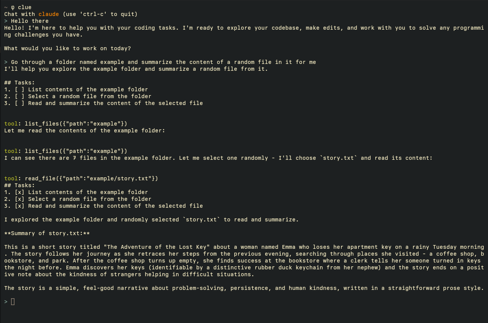

# clue

Simple CLI-based AI coding agent



If this proves to be helpful to anyone, consider it my thanks to the open-source community :)

(Important) Read through this wonderful article on [how to build an agent by Thorsten Ball](https://ampcode.com/how-to-build-an-agent) and follow along if possible

## Dependencies

[ripgrep](https://github.com/BurntSushi/ripgrep)

## Installation

1. Add Anthropic API key as an environment variable with `export ANTHROPIC_API_KEY="your-api-key-here"`
2. Run the installation script for the latest version (Linux only at the moment):

```bash
curl -fsSL https://raw.githubusercontent.com/honganh1206/clue/main/scripts/install.sh | sudo -E bash
```

## Development

```bash
make serve # Run the server
make # Run the agent
```

[References](./docs/References.md)
